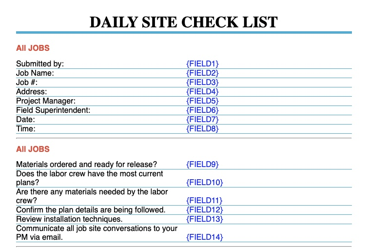
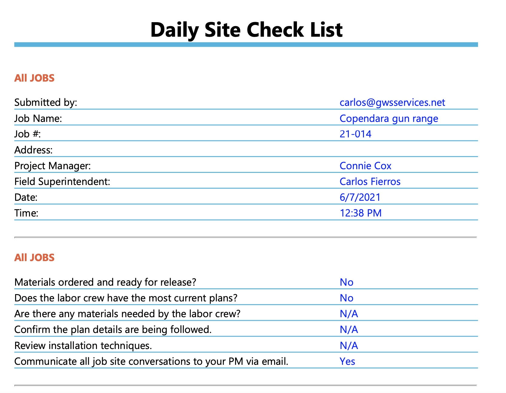

{\rtf1\ansi\ansicpg1252\cocoartf2580
\cocoatextscaling0\cocoaplatform0{\fonttbl\f0\fswiss\fcharset0 Helvetica;}
{\colortbl;\red255\green255\blue255;}
{\*\expandedcolortbl;;}
\margl1440\margr1440\vieww28300\viewh14580\viewkind0
\pard\tx720\tx1440\tx2160\tx2880\tx3600\tx4320\tx5040\tx5760\tx6480\tx7200\tx7920\tx8640\pardirnatural\partightenfactor0

\f0\fs24 \cf0 # Daily Field Reports\
This is HTML code that was used to create PDF forms for daily field reports that were filled in Microsoft Forms. It used Microsoft Power Automate on the back end. When the forms were completed by field personnel, a PDF was created, saved on to the companies Sharepoint, and emailed to the responsible project manager. This kept field personnel from having to drive to their main office many times a week to submit paper reports, and gave management the upper edge to be informed on their projects.\
\
# What I learned\
* Using Power Automate to save time by creating relative workflows.\
* Using HTML/CSS code to produce PDF reports.\
\
# HTML Report Format\
\
\
# Report Output\
}
